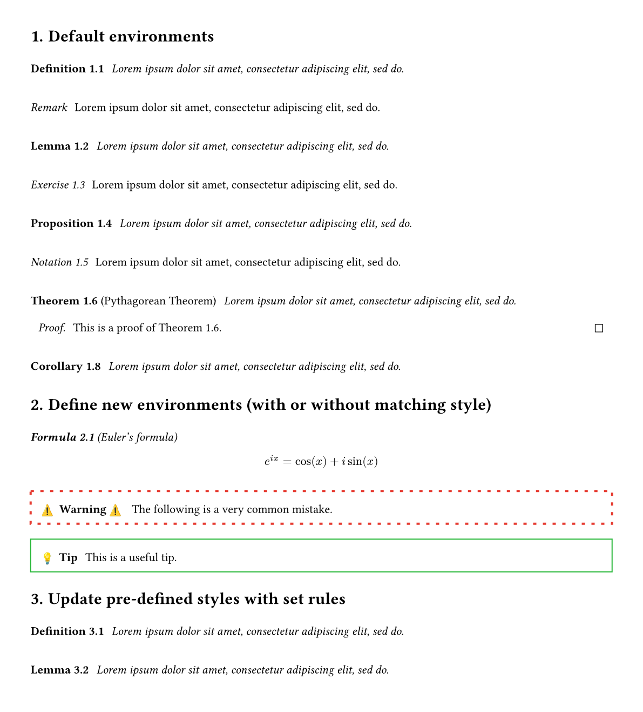
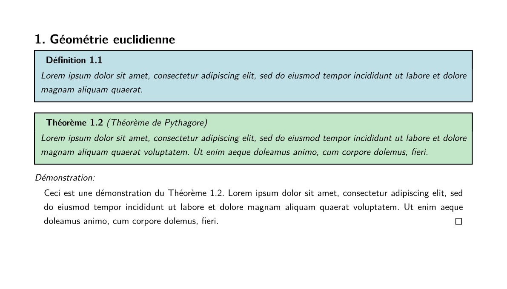
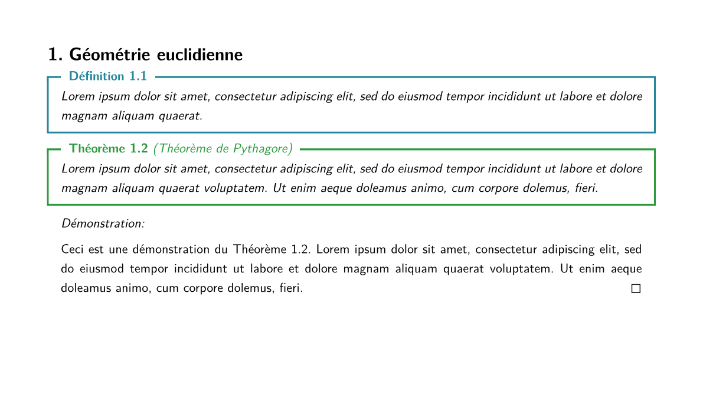
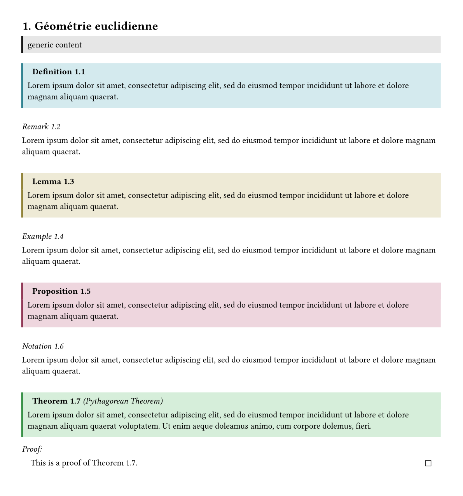
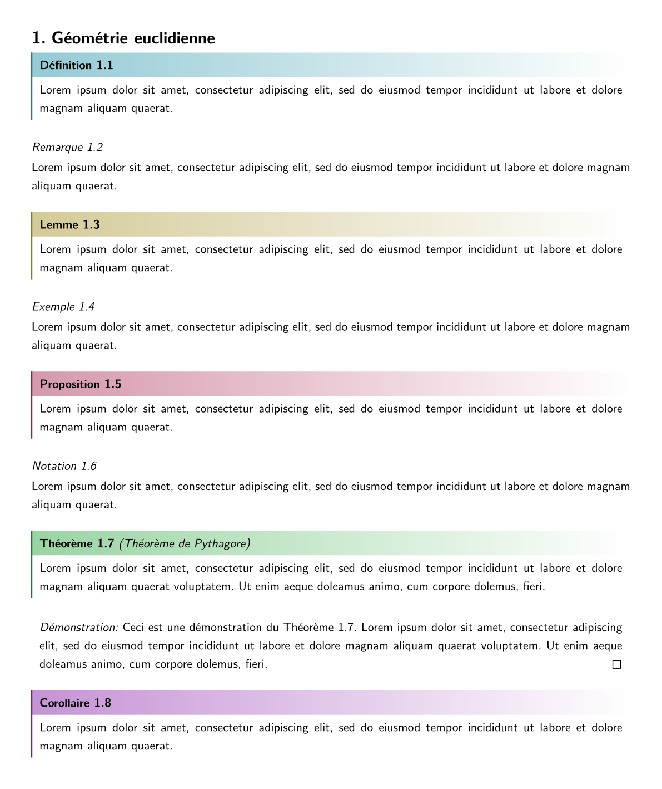
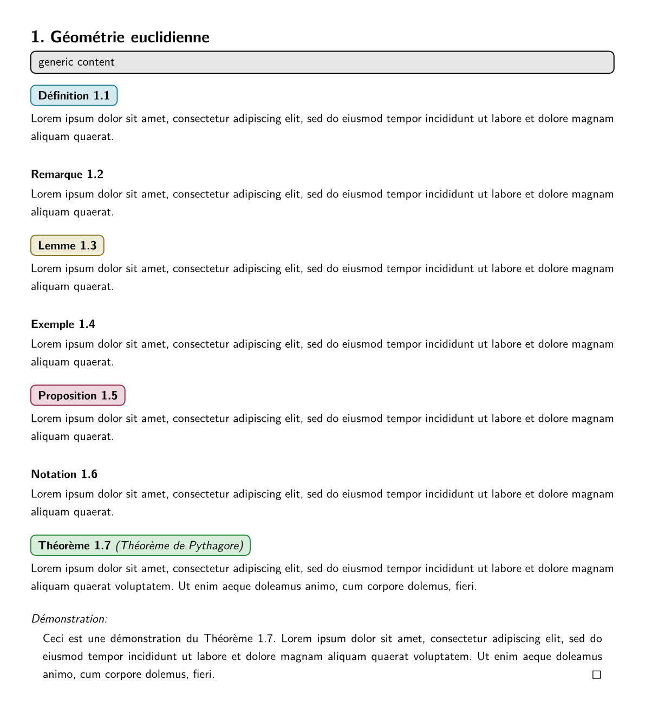

# Mathemateach

Mathemateach is a typst package (not yet published on the [Typst  universe](https://typst.app/universe/)) which contains tools for writing lecture notes for teaching mathematics. For now, it only contains highly customisable theorem boxes and comes along with four themes that can be used out of the box. But there will be additional features soon (for example some custom CetZ elements).

> [!NOTE]
> As this package was primary build for personal use, there is currently no documentation. The code is also a bit messy (and not at all commented !)

## Dependencies
Mathemateach is build on top of the [showybox](https://github.com/Pablo-Gonzalez-Calderon/showybox-package) package and also uses [rich-counters](https://github.com/jbirnick/typst-rich-counters) counters and [elembic](https://github.com/PgBiel/elembic) custom elements and set/show rules.

## Supported langages

French, German and English are supported and theorem titles depend on text langage. Can be changed by using the usual set rule:

```typst
#set text(lang: "en")
```

## Quickstart
Simply download the package locally (as described on the [Typst Packages](https://github.com/typst/packages)) repository. Then import and use mathemateach. 

### simple theme
```typst
#import "@local/mathemateach:0.1.0": *

// import simple style
#import theorem.simple: * 

#set page(height: auto, margin: 1cm)

// *optional*: personal default settings (fonts, layout, etc.)
#show: apply-default 

// applies the imported style, with theorem counter based on level-1 headings
#show: show-theorem.with(counter-level: 1)  

= Géométrie euclidienne

// a generic styled box
#generic-theorem[generic content]

#definition[ #lorem(20) ]

#remark[ #lorem(20) ]

#lemma[ #lorem(20) ]

#example[ #lorem(20) ]

#proposition[ #lorem(20) ]

#notation[ #lorem(20) ]

// a theorem followed by its proof
#theorem(label: <thm1>, name: [Théorème de Pythagore])[ #lorem(30) ]
#proof[ Ceci est une démonstration du @thm1. #lorem(30) ]

#corollary[ #lorem(20) ]

```



### box-colorful theme
```typst
#import "@local/mathemateach:0.1.0": *

// import box-colorful style
#import theorem.box-colorful: * 

#set page(height: auto)

#show: apply-default 
#show: show-theorem.with(counter-level: 1)  

[...]

```



### fancy-colorful theme
```typst
#import "@local/mathemateach:0.1.0": *

// import fancy-colorful style
#import theorem.fancy-colorful: * 

#set page(height: auto)

#show: apply-default 
#show: show-theorem.with(counter-level: 1)  

[...]

```



### bar-colorful theme
```typst
#import "@local/mathemateach:0.1.0": *

// import bar-colorful style
#import theorem.bar-colorful: * 

#set page(height: auto)

#show: apply-default 
#show: show-theorem.with(counter-level: 1)  

[...]

```



### tbar-colorful theme
```typst
#import "@local/mathemateach:0.1.0": *

// import tbar-colorful style
#import theorem.tbar-colorful: * 

#set page(height: auto)

#show: apply-default 
#show: show-theorem.with(counter-level: 1)  

[...]

```



### smallbox-colorful theme
```typst
#import "@local/mathemateach:0.1.0": *

// import smallbox-colorful style
#import theorem.smallbox-colorful: * 

#set page(height: auto)

#show: apply-default 
#show: show-theorem.with(counter-level: 1)  

[...]

```


