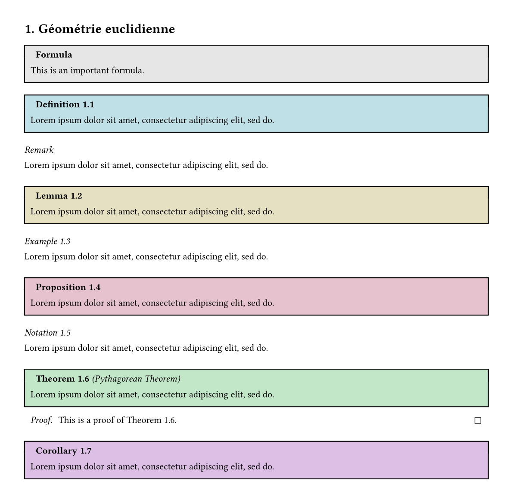
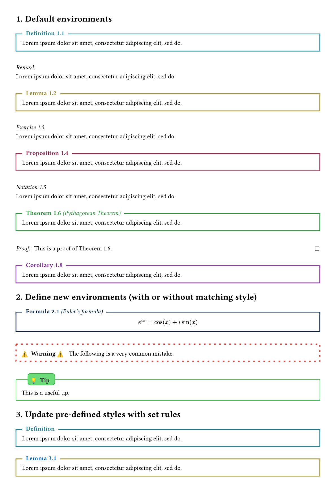
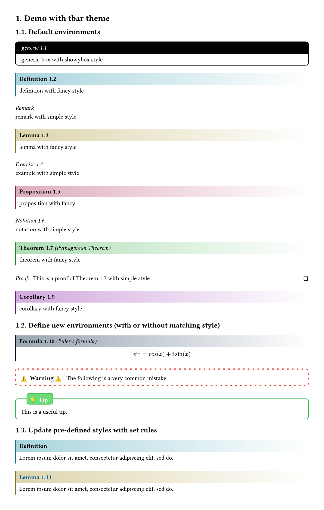
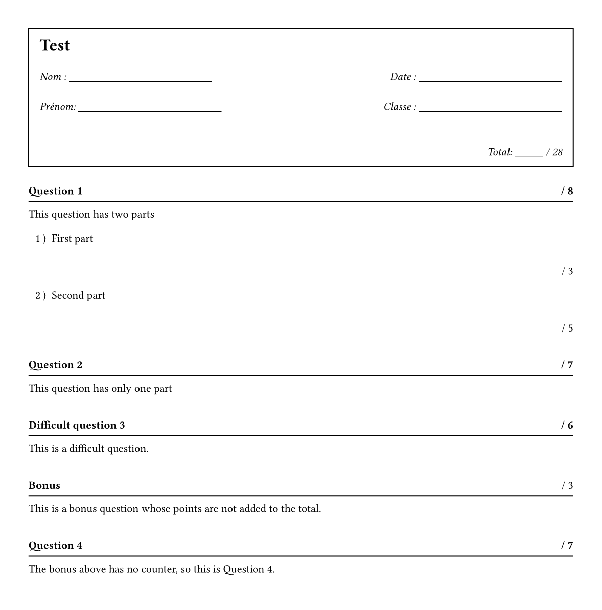
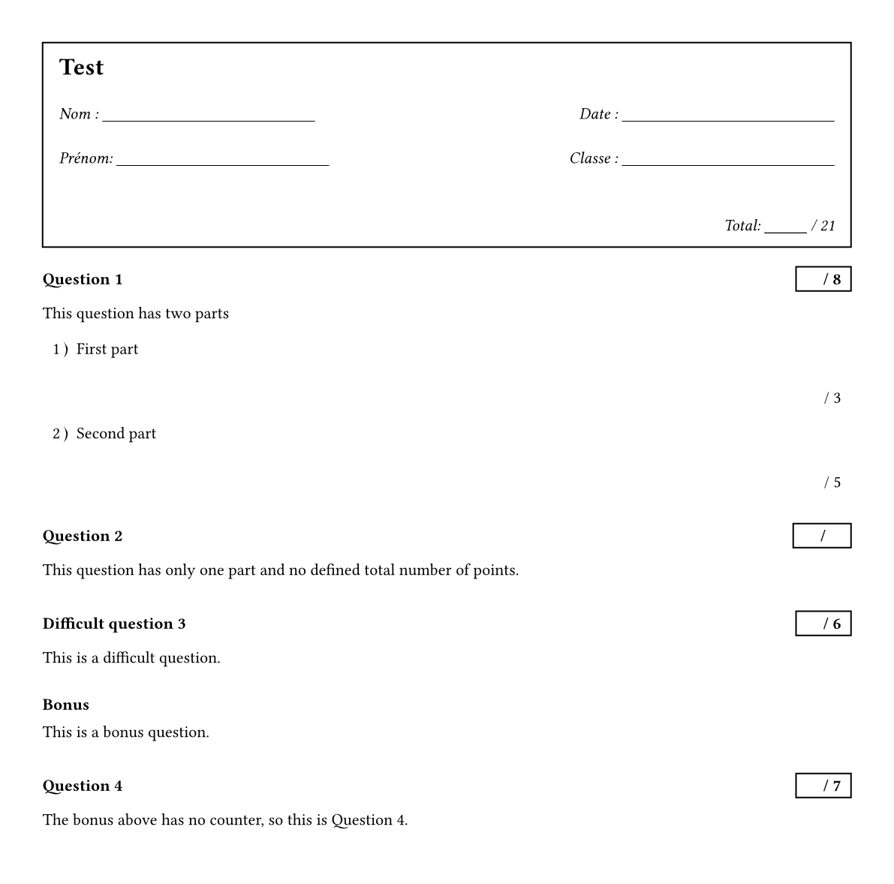
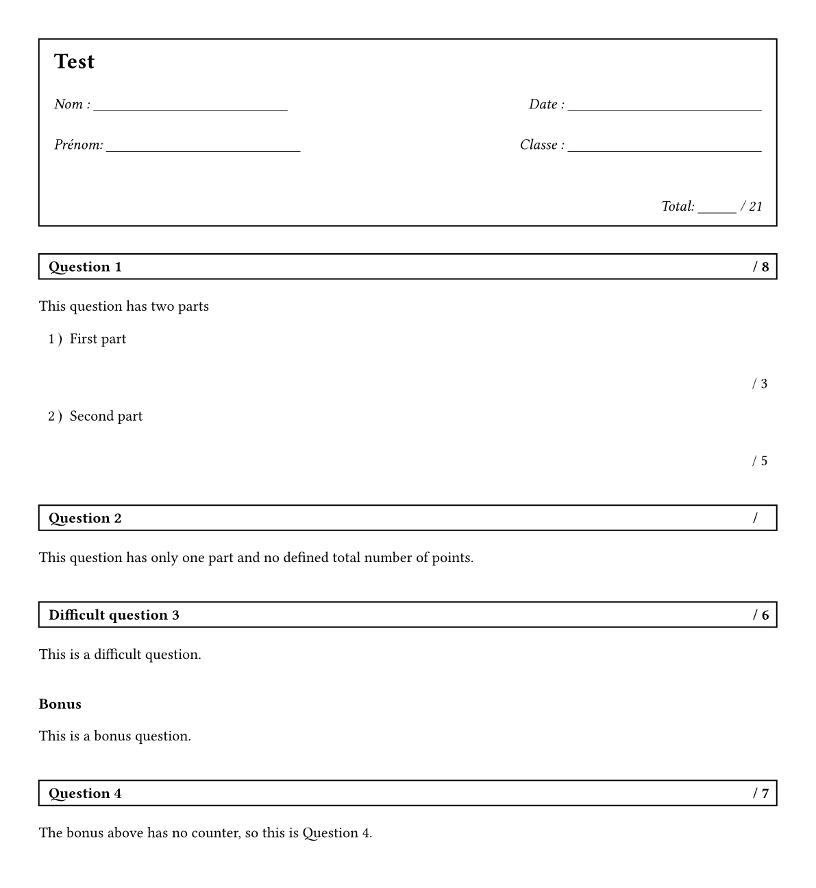

# Mathemateach

Mathemateach is a typst package (not yet published on the [Typst  universe](https://typst.app/universe/)) which contains tools for writing lecture notes for teaching mathematics. For now, it only contains highly customisable theorem boxes and comes along with four themes that can be used out of the box. But there will be additional features soon (for example some custom CetZ elements).

> [!NOTE]
> As this package was primary build for personal use, there is currently no documentation. The code is also a bit messy (and not at all commented !)

## Dependencies
Mathemateach is build on top of the [showybox](https://typst.app/universe/package/showybox/) package and also uses [rich-counters](https://typst.app/universe/package/rich-counters/) counters and [elembic](https://typst.app/universe/package/elembic/) custom elements and set/show rules. It also uses [linguify](https://typst.app/universe/package/linguify/) to manage langage support.

## Supported langages

French, German and English are supported and theorem titles depend on text langage (default to english). Can be changed by using the usual set rule:

```typst
#set text(lang: "en")
```

## Quickstart
Simply download the package locally (as described on the [Typst Packages](https://github.com/typst/packages)) repository. Then import and use mathemateach. 

```typst
#import "@local/mathemateach:0.1.0": *
```

## Theorem styles

### simple theme
```typst
#import "@local/mathemateach:0.1.0": *

// import simple style
#import theorem.simple: * 

#set page(height: auto, margin: 1cm)
#set heading(numbering: "1.")

// applies the imported style, with theorem counter based on level-1 headings
#show: show-theorem.with(counter-level: 1)  

= Géométrie euclidienne

// a generic customisable box with matching styling (use (counter, name) => [] for custom title)
#generic-box(title: build-title("Formula"), counter: none)[This is an important formula.]

#definition[ #lorem(10) ]

#remark(counter: none)[ #lorem(10) ]

#lemma[ #lorem(10) ]

#example[ #lorem(10) ]

#proposition[ #lorem(10) ]

#notation[ #lorem(10) ]

// a theorem followed by its proof
#theorem(label: <thm1>, name: [Pythagorean Theorem])[ #lorem(10) ]
#proof[ This is a proof of @thm1. ]

#corollary[ #lorem(10) ]

```


### box theme
```typst
#import "@local/mathemateach:0.1.0": *

// import box style
#import theorem.box: * 

#set page(height: auto, margin: 1cm)
#set heading(numbering: "1.")

#show: show-theorem.with(counter-level: 1)  

[...]

```



### fancy theme
```typst
#import "@local/mathemateach:0.1.0": *

// import fancy style
#import theorem.fancy: * 

#set page(height: auto, margin: 1cm)
#set heading(numbering: "1.")

#show: show-theorem.with(counter-level: 1)  

[...]

```



### bar theme
```typst
#import "@local/mathemateach:0.1.0": *

// import bar style
#import theorem.bar: * 

#set page(height: auto, margin: 1cm)
#set heading(numbering: "1.")

#show: show-theorem.with(counter-level: 1)  

[...]

```


### tbar theme
```typst
#import "@local/mathemateach:0.1.0": *

// import tbar style
#import theorem.tbar: * 

#set page(height: auto, margin: 1cm)
#set heading(numbering: "1.")

#show: show-theorem.with(counter-level: 1)  

[...]

```



### smallbox theme
```typst
#import "@local/mathemateach:0.1.0": *

// import smallbox style
#import theorem.smallbox: * 

#set page(height: auto, margin: 1cm)
#set heading(numbering: "1.")

#show: show-theorem.with(counter-level: 1)  

[...]

```


## Exam styles

### underline theme

```typst
#import "@local/mathemateach:0.1.0": *

// import underline style
#import exam.underline: *

#set page(height: auto, margin: 1cm)

// show exam header with total points
#show: show-header

// apply exam style
#show: show-exam

#question[
  This question has two parts
  #subquestion(points: 3)[First part #v(2em)]
  #subquestion(points: 5)[Second part #v(2em)]
]

#question(points: 7)[
  This question has only one part
]

#question(title: build-title("Difficult question"), points: 6)[This is a difficult question.]

#question(title: [*Bonus* #h(1fr)/ 3], counter: none)[This is a bonus question whose points are not added to the total.]

#question(points: 7, label: <this-question>)[
  The bonus above has no counter, so this is @this-question.
]

```



### boxed-pts theme

```typst
#import "@local/mathemateach:0.1.0": *

// import boxed-pts style
#import exam.boxed-pts: *

#set page(height: auto, margin: 1cm)

// show exam header with total points
#show: show-header

// applies exam style
#show: show-exam

[...]

```



### boxed-title theme

```typst
#import "@local/mathemateach:0.1.0": *

// import boxed-title style
#import exam.boxed-title: *

// show exam header with total points
#show: show-header

#set page(height: auto, margin: 1cm)

// applies exam style
#show: show-exam

[...]

```

