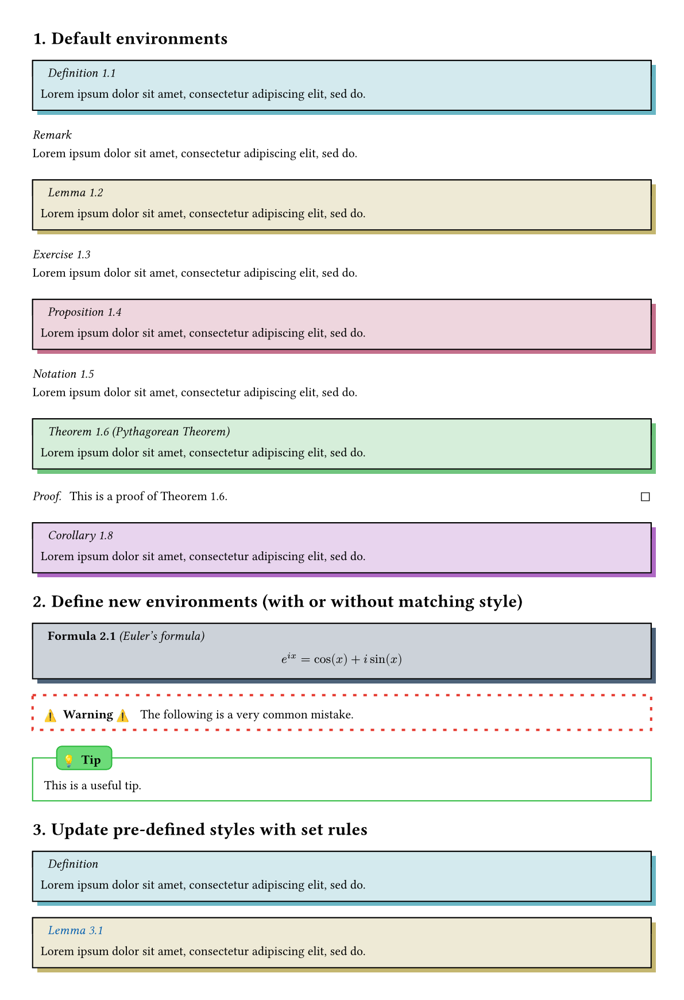
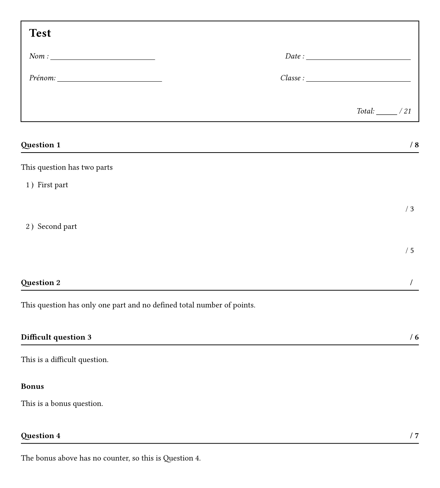

# Mathemateach

Mathemateach is a typst package (not yet published on the [Typst  universe](https://typst.app/universe/)) which contains tools for writing lecture notes for teaching mathematics. For now, it contains highly customizable theorem boxes and comes along with 6 themes that can be used out of the box. It also contains exam template with 2 customizable question themes. But there will be additional features soon (for example some custom CetZ elements).

> [!NOTE]
> As this package was primary build for personal use, there is currently no documentation. The code is also a bit messy (and not at all commented !)

## Dependencies
Mathemateach is build on top of the [showybox](https://typst.app/universe/package/showybox/) package and also uses [rich-counters](https://typst.app/universe/package/rich-counters/) counters and [elembic](https://typst.app/universe/package/elembic/) custom elements and set/show rules. It also uses [linguify](https://typst.app/universe/package/linguify/) to manage langage support.

## Supported langages

French, German and English are supported and theorem titles depend on text langage (default to english). Can be changed by using the usual set rule:

```typst
#set text(lang: "en")
```

## Quickstart
Simply download the package locally (as described on the [Typst Packages](https://github.com/typst/packages)) repository. Then import and use mathemateach. 

```typst
#import "@local/mathemateach:0.1.0": *
```

## Theorem styles

### simple theme
```typst
#import "@local/mathemateach:0.1.0": *

// import theorem simple style
#import theorem.simple: *

#show: show-theorem.with(counter-level: 1)

#set page(height: auto, margin: 1cm)
#set heading(numbering: "1.")

// apply imported style, with theorem counter based on level-1 headings and adding new color for custom "Formula" kind.
#show: show-theorem.with(
  counter-level: 1, 
  colors: (Formula: navy)
)  


= Default environments

#definition[ #lorem(10) ]

#remark(counter: none)[ #lorem(10) ]

#lemma[ #lorem(10) ]

#example[ #lorem(10) ]

#proposition[ #lorem(10) ]

#notation[ #lorem(10) ]

#theorem(label: <thm1>, name: [Pythagorean Theorem])[ #lorem(10) ]
#proof[ This is a proof of @thm1. ]

#corollary[ #lorem(10) ]

= Define new environments (with or without matching style)

// define a formula box with matching styling (note: a color must by added to the color dictionary when applying the show rule,otherwis the matching style is not applied)
#let formula = generic-box.with(
  kind: "Formula",
)

// define a warning box with own styling
#let warning = generic-box.with(
  title: (kind, counter, name) => [*#emoji.warning Warning #emoji.warning * #h(.4em)],
  frame: (
    border-color: red.darken(10%),
    title-color: white,
    body-color: white,
    dash: "loosely-dashed",
    thickness: 2pt,
    body-inset: 10pt,
  ),
  title-style: (
    inline: true,
  ),
  counter: none,
)

// define a tip box with own styling
#let tip = generic-box.with(
  title: (kind, counter, name) => [*#emoji.lightbulb Tip* #h(.4em)],
  frame: (
    border-color: green.darken(10%),
    title-color: green.lighten(30%),
    body-color: white,
    thickness: 1pt,
    body-inset: 10pt,
    title-inset: 5pt,
  ),
  title-style: (
    boxed-style: (offset: (x: 10pt)),
  ),
  counter: none,
)

#formula(name: [Euler's formula])[$ e^(i x) = cos(x) + i sin(x) $]

#warning[The following is a very common mistake.]

#tip[This is a useful tip.] 

= Update pre-defined styles with set rules

// remove definition counter
#show: set-box(
  definition,
  counter: none,
)

#definition[ #lorem(10) ]

// change title color for all pre-defined environments (with "generic-box")
#show: set-box-title-style(
  generic-box,
  color: blue.darken(20%),
)

#lemma[ #lorem(10) ]

```


### box theme
```typst
#import "@local/mathemateach:0.1.0": *

// import box style
#import theorem.box: * 

[...]

```


### fancy theme
```typst
#import "@local/mathemateach:0.1.0": *

// import fancy style
#import theorem.fancy: * 

[...]

```


### bar theme
```typst
#import "@local/mathemateach:0.1.0": *

// import bar style
#import theorem.bar: * 

[...]

```


### tbar theme
```typst
#import "@local/mathemateach:0.1.0": *

// import tbar style
#import theorem.tbar: * 

[...]

```


### shadow theme
```typst
#import "@local/mathemateach:0.1.0": *

// import shadow style
#import theorem.shadow: * 

[...]

```




## Exam styles

### boxed-title theme

```typst
#import "@local/mathemateach:0.1.0": *

// import boxed-title style
#import exam.boxed-title: *

#set page(height: auto, margin: 1cm)

// show exam header with total points
#show: show-header

// apply exam style
#show: show-exam


#question[
  This question has two parts
  #subquestion(points: 3)[First part #v(2em)]
  #subquestion(points: 5)[Second part #v(2em)]
]

#question(points: 0)[
  This question has only one part and no defined total number of points.
]

#question(title: build-title("Difficult question"), points: 6)[This is a difficult question.]

#question(title: [*Bonus*], counter: none)[This is a bonus question.]

#question(points: 7, label: <this-question>)[
  The bonus above has no counter, so this is @this-question.
]

```


### boxed-title as underline theme

```typst
#import "@local/mathemateach:0.1.0": *

// import boxed-title style
#import exam.boxed-title: *

#set page(height: auto, margin: 1cm)

// set points-box to underline
#show: set-box(
  points-box,
  frame: (
    thickness: (bottom: 1pt),
    body-inset: (left: 0em, y: .65em)
  )
)

// show exam header with total points
#show: show-header

// apply exam style
#show: show-exam

[...]

```



### boxed-pts theme

```typst
#import "@local/mathemateach:0.1.0": *

// import boxed-pts style
#import exam.boxed-pts: *

// show exam header with total points
#show: show-header

#set page(height: auto, margin: 1cm)

// applies exam style
#show: show-exam

[...]

```


